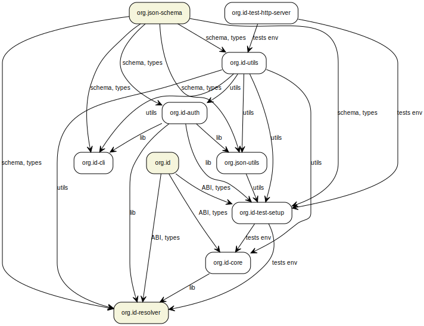

# ORGiD SDK structure

> ORGiD SDK is in beta. Libraries may be unstable and APIs are subject to change.

## SDK repository packages

| Package  | Version | Description  |
|---|---|---|
| [@windingtree/org.id-utils](https://github.com/windingtree/org.id-sdk/tree/master/packages/utils#readme) |  | Shared ORGiD utilities |
| [@windingtree/org.id-auth](https://github.com/windingtree/org.id-sdk/tree/master/packages/auth#readme) |  | ORGiD authentication library |
| [@windingtree/org.id-core](https://github.com/windingtree/org.id-sdk/tree/master/packages/core#readme) |  | Core ORGiD library |
| [@windingtree/org.json-utils](https://github.com/windingtree/org.id-sdk/tree/master/packages/org.json#readme) |  | ORG.JSON utilities |
| [@windingtree/org.id-cli](https://github.com/windingtree/org.id-sdk/tree/master/packages/clip#readme) |  | An ORGiD command-line utility |
| [@windingtree/org.id-test-http-server](https://github.com/windingtree/org.id-sdk/tree/master/packages/test-http-server#readme) |  | Simple Http Server for ORGiD protocol testing |
| [@windingtree/org.id-test-setup](https://github.com/windingtree/org.id-sdk/tree/master/packages/test-setup#readme) |  | Ease ORGiD setup for testing purposes |

## SDK external packages

| Package  | Version | Description  |
|---|---|---|
| [@windingtree/org.json-schema](https://github.com/windingtree/org.json-schema/tree/feat/new-orgid#readme) |  | ORG.JSON schema |
| [@windingtree/org.id](https://github.com/windingtree/org.id/tree/orgid-nft#readme) |  | ORGiD smart contract |
| [@windingtree/org.id-resolver](https://github.com/windingtree/org.id-resolver/tree/new-resolver#readme) |  | ORGiD DID resolver |

## Packages dependency diagram

> External packages marked by the beige color

## Maintenance

The SDK repository is managed with [Lerna package manager](https://github.com/lerna/lerna) and uses a common [sematic versioning](https://semver.org/).
