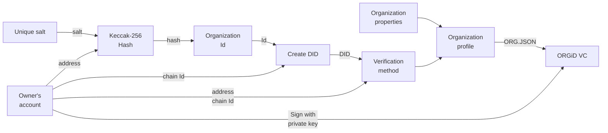
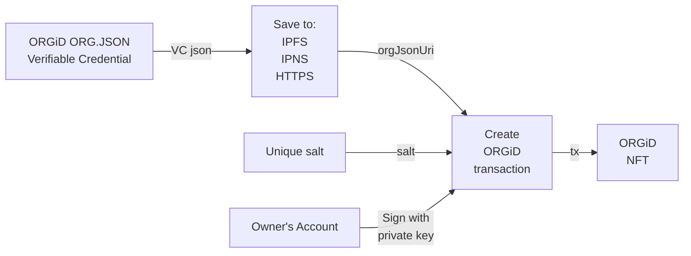
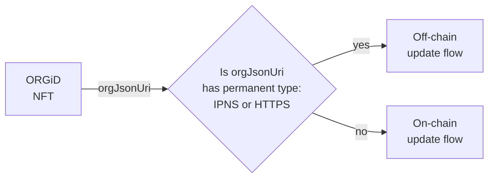
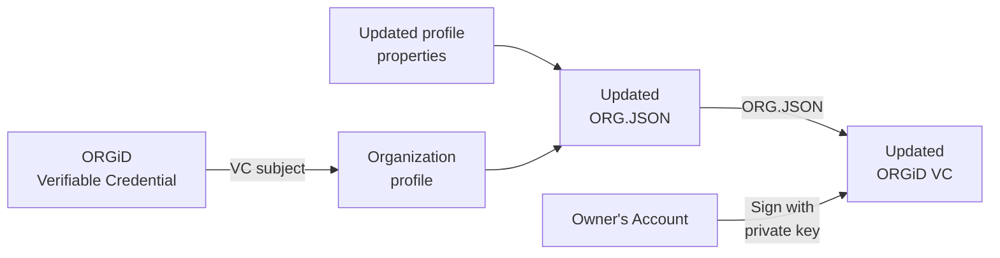
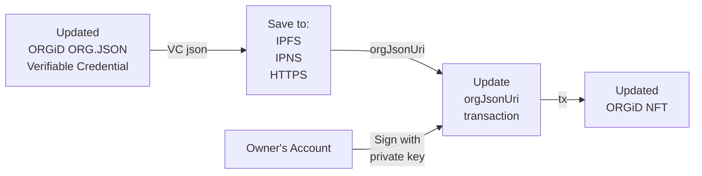
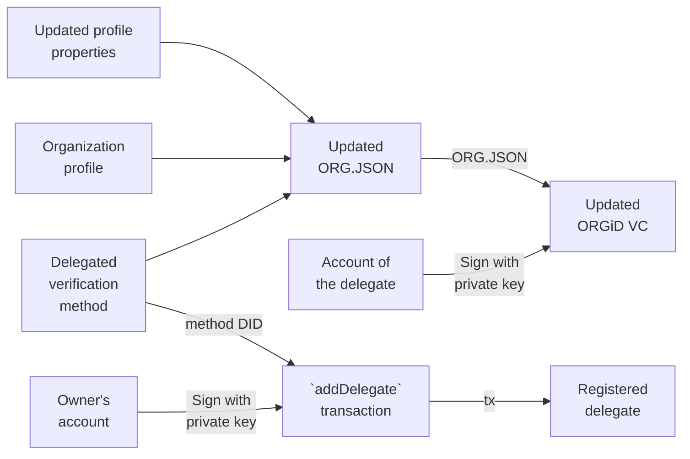
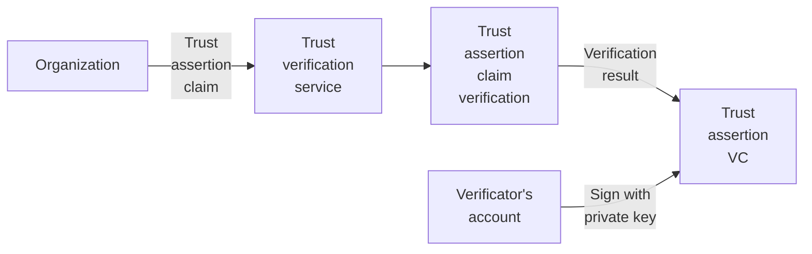
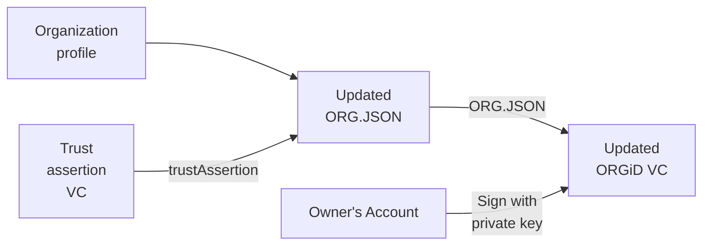

# ORGiD SDK Features

## Decentralized identity

The ORGID [smart contract](https://github.com/windingtree/org.id) is a core component of the protocol that implements a decentralized registry of unique identifiers. Every identifier is exclusively managed by its owner and linked to off-chain metadata.

Everyone can create and manage their identifier and no one can restrict that. It's free, but a blockchain network transaction fee is required. Meanwhile, the ORGiD smart contract is deployed in different EVM compatible networks and most of them have really cheap transactions costs.

Except for the registry of identifiers, the smart contract manages lists of identity delegates. This is a useful feature that allows delegating a capability to manage own identity-related off-chain metadata to specific methods or another entity.

ORGiD SDK provides libraries and utilities for identity management that can be easily integrated into any node.js or browser-based application.

## ORGiD identifier Compatibility

ORGiD identifier follows the [DID specification](https://www.w3.org/TR/did-core/), supports the related data-model and core properties. The DID method for such kind of identifiers is `orgid`.

## Multichain DIDs support

When the idea of the ORGiD has appeared, no one could predict how much an Ethereum transaction would cost. High transaction prices have dramatically affected the adoption of the protocol. To fix that was decided to use alternative blockchain networks with cheaper transaction costs.

Currently, the ORGiD smart contract is deployed to the following chains:

- Gnosis Chain (100): [0xb63d48e9d1e51305a17F4d95aCa3637BBC181b44](https://blockscout.com/xdai/mainnet/address/0xb63d48e9d1e51305a17F4d95aCa3637BBC181b44/read-proxy#address-tabs)
- Polygon (137): [0x8a093Cb94663994d19a778c7EA9161352a434c64](https://polygonscan.com/address/0x8a093Cb94663994d19a778c7EA9161352a434c64#readProxyContract)
- Goerli (5): [0xe02dF24d8dFdd37B21690DB30F4813cf6c4D9D93](https://goerli.etherscan.io/address/0xe02dF24d8dFdd37B21690DB30F4813cf6c4D9D93#readProxyContract)
- Sokol (77): [0xDd1231c0FD9083DA42eDd2BD4f041d0a54EF7BeE](https://blockscout.com/poa/sokol/address/0xDd1231c0FD9083DA42eDd2BD4f041d0a54EF7BeE/read-proxy#address-tabs)
- Columbus (502): [0xd8b75be9a47ffab0b5c27a143b911af7a7bf4076](https://explorer.camino.foundation/c-chain/address/0xd8b75be9a47ffab0b5c27a143b911af7a7bf4076)


### Deprecated deployments

- Rinkeby (4): 0x877c5532B2a76148334CBfA32779A0b9ee414FBE
- Ropsten (3): 0x405005a015EA0E24889D6963447Bb0D646D91C83

As mentioned above, every ORGiD DID contains information in which blockchain network this identifier has been issued. Thanks to that it is easy to implement cross-chain identifiers lookup and verification.

## Off-chain identity metadata modification

Every ORGiD is linked with its off-chain metadata by the URI that can be obtained from the smart contract. The ORGiD protocol supports the following type of URI:

- `HTTP`
- `IPNS` (`IPFS`)

Other URI types can be added as plugins to the ORGiD resolver library. In near plans is implement [Filecoin](https://filecoin.io/) and [Arweave](https://www.arweave.org/) integration plugins.

The ORGiD protocol uses a [verifiable credential](https://www.w3.org/TR/vc-data-model/) standard to provide with an ability of off-chain metadata to be verifiable and its immutability guarantees.

Using the SDK an ORGiD owner (or delegate) is able to manage the source of the metadata file and sign it with the proper signature. Signed this way a metadata file can be easily verified and validated. Even more, the VC standard supports lifetime restrictions for digital credentials so an ORGiD owner can set a specific period of time when its profile will be valid.

Modification of off-chain metadata linked to an identifier does not require updating its URI stored in the smart contract. This approach allowing dramatically reduce transaction costs during ORGiD usage.

## ORGiD NFT

The ORGiD smart contract itself is fully compatible with the [ERC721](https://eips.ethereum.org/EIPS/eip-721) standard that is dedicated to Non-fungible Tokens so every identifier issued is an NFT. This feature increases interoperability and adds the ability to manage ORGiD decentralized identifier ownership using any wallet that supports the NFT standard. An ORGiD owner can hold and transfer their identifiers and even sell them on NFT markets.

The SDK is providing a method of managing NFT-specific metadata like `name`, `description`, `image`, `attributes`, etc along with VC features.

## ORG.JSON schema

The ORG.JSON is an open standard for profiles data for organizations and personals that covers a wide range of use-cases. The ORGiD SDK provides a set of data schemas in the [JSON-schema](http://json-schema.org/specification.html) format that are can be used for data preparation and validation. Also, ORG.JSON [package](https://github.com/windingtree/org.json-schema) of SDK provides a schemas-related set of Typescript typings.

## Authentication and authorization

An ORGiD DIDs and cryptographic features stand behind them can be used to arrange an easy and secure way of authentication and authorization. The ORGiD SDK has powerful tools for the generation and conversion of cryptographic keys, making authentication tokens and their verification.

## Verifiable credentials

[Verifiable credentials](https://www.w3.org/TR/vc-data-model/) can be used in various scenarios in real life, from a representation of physical credentials to tickets, atonements, reputation facts proofs and so on. The SDK has a powerful library to work with VC's that has a built-in data validation feature based on the JSON-schema standard.

## ORGiD flow

### Creation of the ORG.JSON VC



Verification method example:

```json
{
  "id": "did:orgid:4:0x9300bad07f0b9d904b23781e8bbb05c1219530c51e7e494701db2539b7a5a119#key-1",
  "controller": "did:orgid:4:0x9300bad07f0b9d904b23781e8bbb05c1219530c51e7e494701db2539b7a5a119",
  "type": "EcdsaSecp256k1RecoveryMethod2020",
  "blockchainAccountId": "0xBfD9EebE27d5a2F1113220b53844E5066889035C@eip155:1337"
}
```

### Creation of an ORGiD



### An organization profile update



### Off-chain profile update



### On-chain profile update



### Capability delegation



### Trust verification

To verify a trust claim an organization must send a trust assertion claim to the special verification service.
This service is making a verification procedure and as a result, issues a Trust Assertion VC.



A trust assertion VC document confirms that the assertion claim that has been sent by the organization is successfully verified.
Here is an example of the Trust Assertion VC:

```json
{
  "@context": [
    "https://www.w3.org/2018/credentials/v1"
  ],
  "id": "c48aba97-c92b-4189-8546-184112f0ebff",
  "issuer": "did:orgid:0x9300bad07f0b9d904b23781e8bbb05c1219530c51e7e494701db2539b7a5a119",
  "holder": "0x94bf5a57b850a35b4d1d7b59f663ce3a8a76fd9928ef2067cc772fc97fb0ad75",
  "type": [
    "VerifiableCredential",
    "TrustAssertion"
  ],
  "issuanceDate": "2019-06-03T13:20:06.398Z",
  "credentialSubject": {
    "id": "did:orgid:4:0x94bf5a57b850a35b4d1d7b59f663ce3a8a76fd9928ef2067cc772fc97fb0ad75",
    "trustAssertion": {
      "type": "domain",
      "claim": "test2.com",
      "proof": "http://test2.com/orgid.txt"
    }
  },
  "proof": {
    "type": "EcdsaSecp256k1Signature2019",
    "created": "2019-06-03T13:20:06.398Z",
    "proofPurpose": "assertionMethod",
    "verificationMethod": "did:orgid:0x9300bad07f0b9d904b23781e8bbb05c1219530c51e7e494701db2539b7a5a119#key-454312",
    "jws": "eyJhbGciOiJSUzI1NiIsImI2NCI6ZmFsc2UsImNyaXQiOlsiYjY0Il19..."
  }
}
```

All trust assertions should be added to the `trustAssertion` section of the organization profile.



## Typescript support

The ORGiD SDK is made with Typescript and go along with built-in typings.

## Encrypted messaging

> To be developed soon
